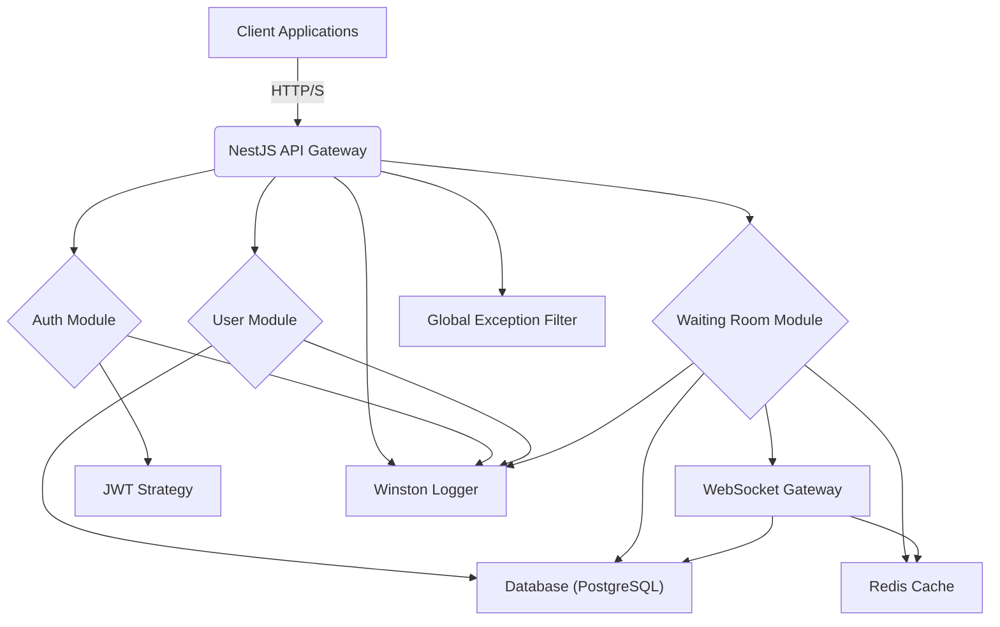

# Technical Deep Dive: Waiting Room Manager API

This document provides a detailed technical overview of the Waiting Room Manager API, covering its architecture, core components, data models, and key functionalities. It is intended for developers who need to understand the internal workings of the service beyond the basic setup instructions provided in `README.md`.

## 1. Introduction and Goals

The Waiting Room Manager API is a robust and scalable backend service designed to manage multiplayer game waiting rooms. Its primary goals are to:
- Provide secure user authentication and authorization.
- Facilitate efficient creation, management, and interaction with waiting rooms.
- Enable real-time communication for instant updates on room and player status.
- Ensure data persistence and integrity using a relational database.
- Offer flexible deployment options via containerization.

## 2. High-Level Architecture

The API is built using the NestJS framework, a progressive Node.js framework for building efficient and scalable server-side applications. It follows a modular architecture, leveraging various technologies for specific concerns:

- **Backend Framework**: NestJS (Node.js, TypeScript)
- **Database**: PostgreSQL, managed with TypeORM
- **Caching**: Redis
- **Real-time Communication**: WebSockets (Socket.IO)
- **Authentication**: JWT (JSON Web Tokens) with Passport.js
- **Containerization**: Docker, with Kubernetes manifests for orchestration
- **Logging**: Winston

The application is structured into distinct modules, each responsible for a specific domain, promoting separation of concerns and maintainability.

## 3. Core Modules and Components

The application is organized into several key NestJS modules:

### 3.1. `AuthModule`
Handles user authentication and authorization.
- **Controllers**: `AuthController` for registration and login endpoints.
- **Services**: `AuthService` for business logic related to user authentication, password hashing (bcrypt), and JWT generation.
- **Strategies**: `JwtStrategy` (Passport.js) for validating JWTs and extracting user information from requests.
- **Guards**: `JwtAuthGuard` for protecting authenticated routes.

### 3.2. `UserModule`
Manages user-related operations.
- **Controllers**: `UserController` (if any, for user profile management).
- **Services**: `UserService` for interacting with user data in the database.
- **Entities**: `User` entity (`src/user/entities/user.entity.ts`) defines the user schema.

### 3.3. `WaitingRoomModule`
Manages the core waiting room functionality.
- **Controllers**: `WaitingRoomController` for HTTP endpoints related to room creation, listing, joining, leaving, and starting games.
- **Services**: `WaitingRoomService` contains the main business logic for room management, including player limits, join request handling, and host-specific actions.
- **Gateways**: `WaitingRoomGateway` handles WebSocket communication for real-time updates on room status, player changes, and game start events.
- **Entities**: `Room` entity (`src/waiting-room/entities/room.entity.ts`) and `RoomPlayer` entity (`src/waiting-room/entities/room-player.entity.ts`) define the waiting room and player association schemas.

### 3.4. `CommonModule`
Contains shared utilities and cross-cutting concerns.
- **Filters**: `AllExceptionsFilter` for centralized HTTP exception handling, ensuring consistent error responses across the API.
- **DTOs**: Common DTOs like `PaginationDto`.
- **Logger**: `LoggerModule` and `LoggerService` for structured logging using Winston.

## 4. Data Model

The application uses PostgreSQL as its primary data store, with TypeORM as the ORM. Key entities include:

- **`User`**: Represents a registered user.
    - `id` (UUID)
    - `username` (string, unique)
    - `password` (string, hashed)
    - `email` (string, unique, optional)
    - `createdAt`, `updatedAt` (timestamps)
- **`Room`**: Represents a waiting room.
    - `id` (UUID)
    - `name` (string, unique)
    - `hostId` (UUID, foreign key to `User`)
    - `isPublic` (boolean)
    - `approvalRequired` (boolean)
    - `maxPlayers` (number)
    - `status` (enum: `LOBBY`, `IN_GAME`, `ENDED`)
    - `createdAt`, `updatedAt` (timestamps)
    - Relations: One-to-many with `RoomPlayer` (players in the room).
- **`RoomPlayer`**: Represents a player's association with a room.
    - `id` (UUID)
    - `roomId` (UUID, foreign key to `Room`)
    - `userId` (UUID, foreign key to `User`)
    - `status` (enum: `JOINED`, `PENDING`, `LEFT`, `KICKED`)
    - `isHost` (boolean)
    - `createdAt`, `updatedAt` (timestamps)

TypeORM migrations (`src/db/migrations/`) are used to manage schema changes, ensuring database consistency across environments.

## 5. Authentication Flow (JWT)

1.  **Registration**: A user sends a `POST /auth/register` request with username and password. The `AuthService` hashes the password using `bcrypt` and saves the new `User` to the database.
2.  **Login**: A user sends a `POST /auth/login` request with credentials.
    - The `AuthService` validates the credentials against the stored hashed password.
    - If valid, a JSON Web Token (JWT) is generated, containing the user's `id` and `username` as payload.
    - The JWT is signed using a secret key (`JWT_SECRET` from environment variables).
    - The JWT is returned to the client.
3.  **Authenticated Requests**: For subsequent requests to protected endpoints:
    - The client includes the JWT in the `Authorization` header as `Bearer <token>`.
    - The `JwtAuthGuard` (Passport.js) intercepts the request.
    - The `JwtStrategy` validates the token's signature and expiration.
    - If valid, the user payload is attached to the request object (`req.user`), making it accessible in controllers and services.
    - If invalid or missing, an `Unauthorized` exception is thrown.

## 6. Real-time Communication (WebSockets)

The `WaitingRoomGateway` (`src/waiting-room/waiting-room.gateway.ts`) leverages Socket.IO to provide real-time updates.

- **Connection**: Clients establish a WebSocket connection to the API.
- **Room-specific Events**:
    - When a player joins/leaves a room, or a room's status changes (e.g., game starts), the `WaitingRoomService` emits Socket.IO events to all connected clients subscribed to that specific room's updates.
    - This ensures that all players in a room, or those observing public rooms, receive immediate notifications without needing to poll the API.
- **Event Handling**: The gateway defines handlers for various WebSocket events (e.g., `joinRoom`, `leaveRoom`) and emits events back to clients (e.g., `roomUpdated`, `playerJoined`).

## 7. Caching (Redis)

Redis is integrated for caching frequently accessed data to improve performance and reduce database load.

- **Configuration**: Redis connection details (`REDIS_HOST`, `REDIS_PORT`, `REDIS_PASSWORD`, `REDIS_TTL`) are managed via environment variables.
- **Cached Operations**: The `WaitingRoomService.findRoomById(id: string)` method is currently cached. When this method is called:
    - It first checks the Redis cache for the room data.
    - If found, the cached data is returned immediately.
    - If not found, the data is fetched from PostgreSQL, stored in Redis with a defined TTL, and then returned.
- **Invalidation Strategy**: To maintain data consistency, the cache for a specific room is explicitly invalidated (deleted from Redis) whenever a room is updated, deleted, a player's status changes within the room, or a game starts. This ensures that subsequent reads fetch the most up-to-date data from the database.

## 8. Logging (Winston)

The application uses Winston for structured, contextual logging.

- **Configuration**: The `LOG_LEVEL` environment variable controls the verbosity (`error`, `warn`, `info`, `debug`, `verbose`).
- **Output**: Logs are output in JSON format to the console (standard output). This format is ideal for ingestion by external log management systems (e.g., ELK stack, Splunk, CloudWatch Logs).
- **Contextual Information**: Logs include relevant context such as method names, user IDs, and request IDs to aid in debugging and tracing issues across the application.

## 9. Deployment Considerations

The API is designed for containerized deployment, supporting both Docker Compose for local multi-service environments and Kubernetes for production-grade orchestration.

### 9.1. Docker
- A `Dockerfile` defines the build process for the NestJS application, creating a lightweight image.
- The image can be run as a standalone container, passing environment variables via `--env-file`.

### 9.2. Docker Compose
- `docker-compose.yml` orchestrates a multi-service environment, including the API, PostgreSQL (`db`), and Redis (`cache`).
- This setup simplifies local development by managing service dependencies and networking.

### 9.3. Kubernetes
- Kubernetes manifests (`k8s/` directory) define deployments, services, stateful sets, config maps, and secrets for deploying the API, PostgreSQL, and Redis on a Kubernetes cluster (e.g., Kind for local development).
- **Secrets Management**: Sensitive information like `JWT_SECRET` and database credentials are managed as Kubernetes Secrets, preventing them from being hardcoded or committed to version control.
- **Service Discovery**: Kubernetes Services provide stable network endpoints for internal communication between pods (e.g., API connecting to `postgres-service` and `redis-service`).
- **Persistent Storage**: PostgreSQL uses a StatefulSet with persistent volumes for data durability.

This document provides a foundational understanding of the Waiting Room Manager API's technical aspects. For more specific implementation details, refer to the source code within the `src/` directory.

## 10. Navigating the Annotated Codebase

To effectively understand the implementation details and internal logic of the Waiting Room Manager API, developers should refer to the source code within the `src/` directory. The codebase has been "smartly annotated" to provide a guided tour through its architecture and design patterns.

**Key aspects of the annotations:**

-   **Focus on Architecture and Logic**: Annotations primarily explain *why* certain architectural choices were made, *how* different modules interact, and the *flow of logic* through complex operations.
-   **Highlighting Non-Obvious Details**: Comments are strategically placed to clarify aspects that might not be immediately apparent due to NestJS's modularity, dependency injection, or the use of specific libraries (e.g., TypeORM decorators, Passport.js strategies, Socket.IO events).
-   **Journey-Oriented**: The annotations aim to take the reader on a "journey" through the code, explaining the purpose of classes, methods, and key configurations, rather than detailing every single variable or obvious line of code.
-   **JSDoc for Public APIs**: Public methods and classes often include JSDoc comments, providing a high-level overview of their purpose, parameters, and return values, which can be used by IDEs for quick insights.

**How to use the annotations:**

1.  **Start with `src/main.ts`**: This file is the application's entry point and contains global configurations (logging, exception filters, CORS, Swagger). Its annotations explain the initial setup and bootstrapping process.
2.  **Explore Module Definitions**: Review `src/app.module.ts` and other `*.module.ts` files (e.g., `src/auth/auth.module.ts`, `src/waiting-room/waiting-room.module.ts`) to understand how different parts of the application are organized and wired together.
3.  **Follow the Request Flow**: When examining a controller (e.g., `src/auth/auth.controller.ts`, `src/waiting-room/waiting-room.controller.ts`), pay attention to how requests are received, validated (DTOs), and then delegated to services.
4.  **Dive into Business Logic**: Services (e.g., `src/auth/auth.service.ts`, `src/user/user.service.ts`, `src/waiting-room/waiting-room.service.ts`) contain the core business logic. Their annotations explain the steps involved in operations, database interactions, caching, and WebSocket emissions.
5.  **Understand Cross-Cutting Concerns**: Files in `src/common/` (e.g., `src/common/filters/all-exceptions.filter.ts`, `src/common/logger/logger.service.ts`) provide insights into global error handling and structured logging.
6.  **Database Interactions**: `src/db/data-source.ts` and migration files (`src/db/migrations/`) explain the database setup and schema evolution. Entity files (e.g., `src/user/entities/user.entity.ts`, `src/waiting-room/entities/room.entity.ts`) detail the data model.
7.  **Real-time Mechanics**: `src/waiting-room/waiting-room.gateway.ts` is key to understanding how WebSocket events are handled and real-time updates are broadcast.

By combining the high-level architectural overview in this document with the detailed, context-rich annotations in the source code, developers should be well-equipped to understand, maintain, and extend the Waiting Room Manager API.